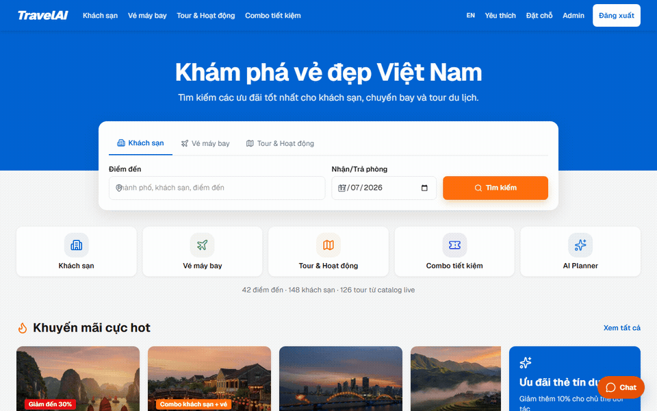
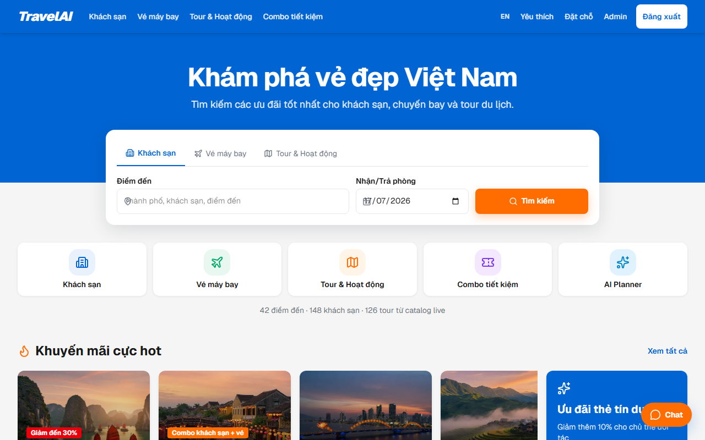
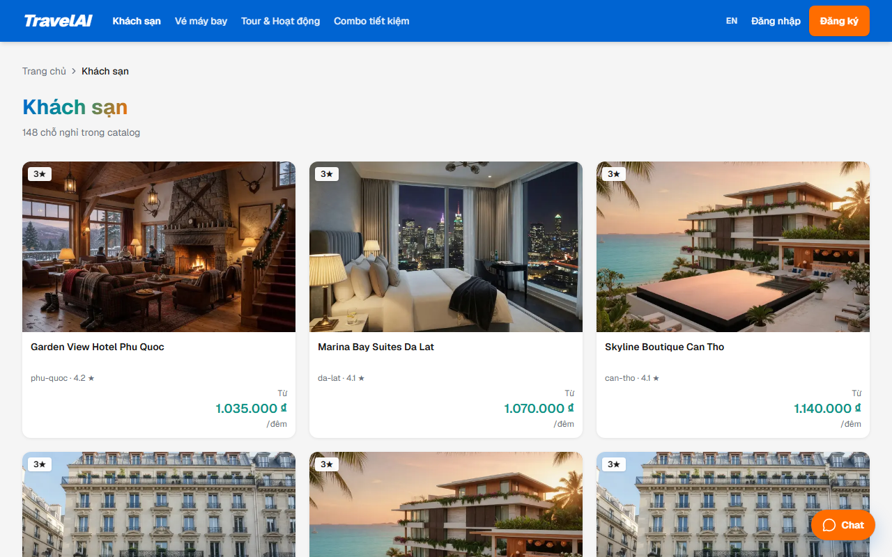
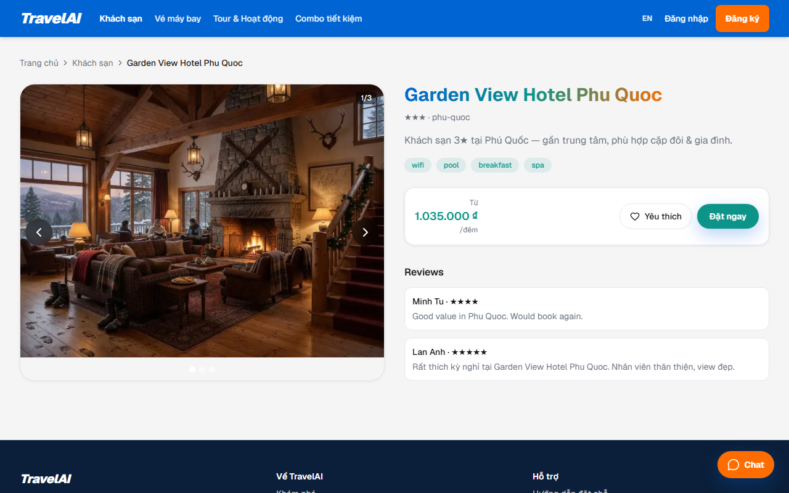
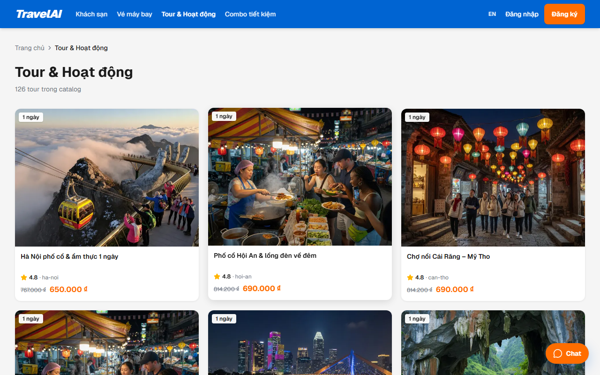
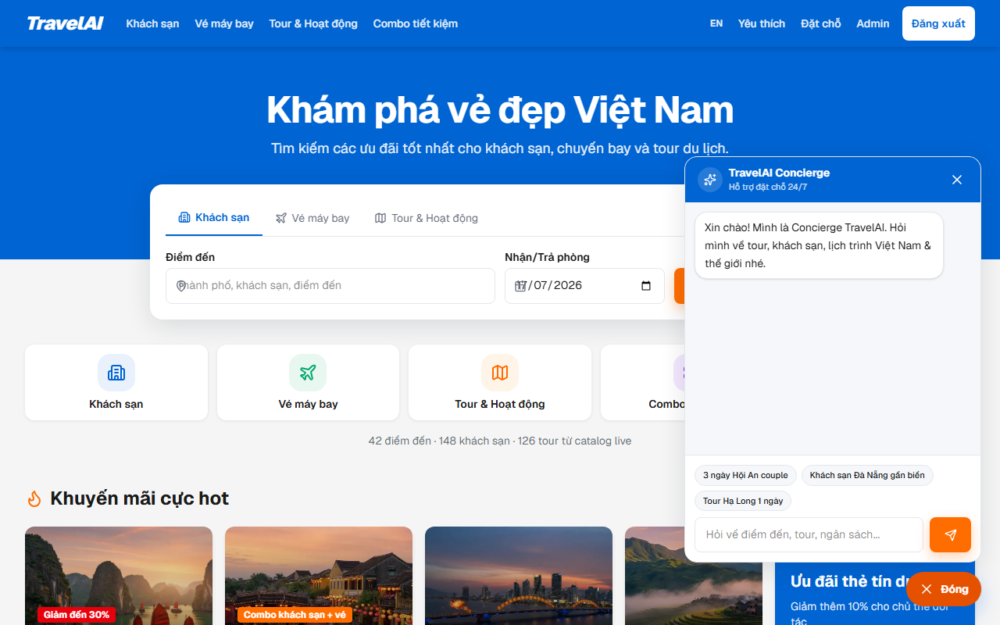
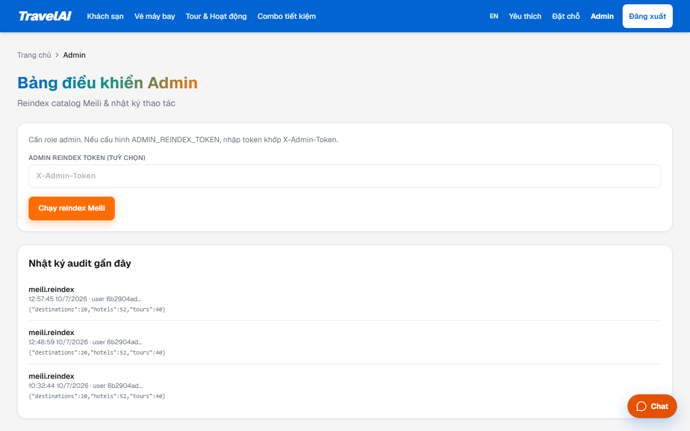
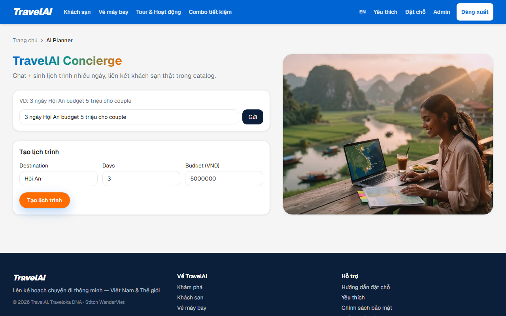
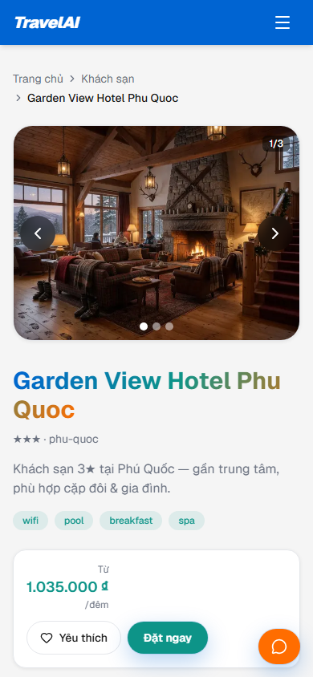
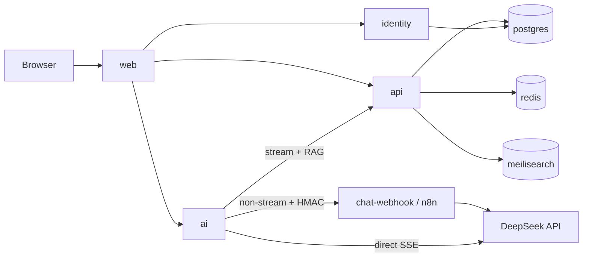

# TravelAI

<p align="center">
  
</p>

<p align="center">
  <strong>Lên kế hoạch chuyến đi thông minh — Việt Nam &amp; Thế giới</strong><br/>
  Marketplace du lịch kiểu Traveloka + AI concierge (DeepSeek V4 Flash) · monorepo Docker
</p>

<p align="center">
  
  
  
  
  
  
  
  <a href="https://github.com/JasonTM17/VN_TravelAI/releases"></a>
  
</p>

<p align="center">
  <strong>Project status:</strong> MVP demo + production <em>hardening baseline</em> trên monorepo service-split.<br/>
  Payment = <strong>MOCK</strong> · AI chat = <strong>COMPLETE path</strong> (DeepSeek + Meili/vector RAG + tools + SSE; live khi có key) · Cloud deploy target = <strong>UNKNOWN</strong>
</p>

<p align="center">
  <a href="#quick-start">Quick Start</a> ·
  <a href="#screenshots">Screenshots</a> ·
  <a href="#architecture">Architecture</a> ·
  <a href="#ai--deepseek">AI</a> ·
  <a href="#releases--packages">Releases</a> ·
  <a href="docs/README.md">Documentation</a>
</p>

---

## Điểm nổi bật

| Highlight | Status |
|-----------|--------|
| Live catalog (seed Postgres) + promo carousel | COMPLETE |
| Hotels / tours list, detail, multi-image gallery | COMPLETE |
| Meilisearch unified search | COMPLETE |
| Ed25519 JWT + dual JWKS identity + httpOnly refresh cookie | COMPLETE |
| Booking lifecycle + **mock** pay / cancel state machine | COMPLETE + MOCK pay |
| Hotel PMS (room types + rate plans + night inventory) | COMPLETE (demo PMS) |
| Email notifications (SMTP / HTTP gateway / log) | COMPLETE path |
| Global chatbot + AI itinerary (DeepSeek + RAG + tools + SSE) | COMPLETE path (key optional → degraded) |
| Admin Meili reindex + vector reindex + audit | COMPLETE |
| Responsive mobile web | COMPLETE (demo UX) |
| Docker Compose multi-service · GHCR private packages · Releases | COMPLETE; GHCR publish verified |

---

## Screenshots

| Home + live catalog stats | Hotels list + pagination |
|:---:|:---:|
|  |  |

| Multi-slide hotel gallery | Tours catalog |
|:---:|:---:|
|  |  |

| Global chatbot | Admin console |
|:---:|:---:|
|  |  |

| AI planner | Mobile gallery (~390px) |
|:---:|:---:|
|  |  |

More assets: [`docs/media/`](docs/media/README.md) (gồm `05-explore`, `09-mobile-home`, gallery slides, frames)

---

## Features

- **Catalog (seeded Postgres)**: 40+ destinations · 140+ hotels · 120+ tours · flights & transport · multi-image galleries from DB `images[]`
- **Home promos**: data-driven `GET /v1/promos` (not hard-coded product cards)
- **Search**: Meilisearch reindex after boot / admin; optional **vector** search (`/v1/search/vectors`)
- **Auth**: Ed25519 JWT + dual JWKS; refresh via **httpOnly cookie**; access token in memory (optional sessionStorage)
- **Bookings**: hotel/tour/flight/transport; hotel **room type + rate plan**; night inventory; mock pay ledger
- **Notifications**: booking-confirmed email via nodemailer SMTP, HTTP gateway, or log-only
- **AI concierge**: SSE path = shared RL + **Meili/vector RAG** + direct DeepSeek; non-stream path = HMAC webhook + read-only tools; both degrade without live config
- **Admin**: `/vi/admin` Meili reindex, vector reindex, audit log (`role=admin`)
- **Mobile web**: responsive navbar, promo carousel, touch targets
- **Containers**: multi-service Docker Compose · **Docker Hub** + **GitHub Packages (GHCR)** · tagged **Releases**

> [!NOTE]
> Booking payment là **mock** (không real PSP). Không tích hợp Traveloka partner APIs. Cloud production host = chưa chốt.

---

## Architecture



| Service | Path | Host port (local overlay) | GHCR | Docker Hub |
|---------|------|---------------------------|------|------------|
| web | [`web/`](web/README.md) | **53000** | `ghcr.io/jasontm17/travelai-web` | `nguyenson1710/travelai-web` |
| api | [`api/`](api/README.md) | **53001** | `ghcr.io/jasontm17/travelai-api` | `nguyenson1710/travelai-api` |
| identity | [`identity/`](identity/README.md) | **53002** | `ghcr.io/jasontm17/travelai-identity` | `nguyenson1710/travelai-identity` |
| ai | [`ai/`](ai/README.md) | **53003** | `ghcr.io/jasontm17/travelai-ai` | `nguyenson1710/travelai-ai` |

Contract: [`docs/openapi.yaml`](docs/openapi.yaml) · Architecture: [`docs/system-architecture.md`](docs/system-architecture.md) · ADRs: [`docs/adr/`](docs/adr/) · Docs index: [`docs/README.md`](docs/README.md)

> SSR inside Docker uses `API_INTERNAL_URL=http://api:3001` while the browser uses `NEXT_PUBLIC_*` host ports.

---

## Quick start

```bash
git clone https://github.com/JasonTM17/VN_TravelAI.git
cd VN_TravelAI
cp .env.example .env

# Remapped ports (avoids FoodFlow / other stacks on 3000–3003)
docker compose -f docker-compose.yml -f docker-compose.local.yml up -d --build
```

| URL | Service |
|-----|---------|
| http://localhost:53000 | Web (default locale `vi`) |
| http://localhost:53001/healthz | API |
| http://localhost:53002/healthz | Identity |
| http://localhost:53003/healthz | AI |

**Demo user** (local only — see `.env.example`; requires `SEED_DEMO_USER=true`):

- Email: `demo@travelai.local`
- Password: `DemoTravelAI1!`
- Role: **admin** (local seed)

```bash
# Smoke
./scripts/smoke.ps1
# Live chat (optional DeepSeek key in .env)
node scripts/smoke-chat.mjs
```

Native (không Docker full stack): xem [`docs/getting-started/local-setup.md`](docs/getting-started/local-setup.md).

### DeepSeek live chat

```env
DEEPSEEK_API_KEY=sk-...
DEEPSEEK_MODEL=deepseek-v4-flash
DEEPSEEK_BASE_URL=https://api.deepseek.com
```

```bash
docker compose -f docker-compose.yml -f docker-compose.local.yml up -d --force-recreate chat-webhook ai
# or
./scripts/reload-deepseek-chat.ps1
```

Chi tiết AI: [`docs/ai/deepseek-chatbot.md`](docs/ai/deepseek-chatbot.md).

---

## AI & DeepSeek

| Capability | Status |
|------------|--------|
| Chat Completions via webhook + HMAC | COMPLETE path |
| Model default `deepseek-v4-flash` | COMPLETE config |
| Degraded fallback without key | COMPLETE |
| SSE streaming (`POST /v1/chat/stream`) | COMPLETE path |
| Meili + vector RAG | COMPLETE stream path; vector index requires admin reindex |
| Read-only tool-calling | COMPLETE non-stream webhook path |
| Chat conversation/message DB | COMPLETE path; client best-effort persistence |

---

## Security (tóm tắt)

- Production JWT: Ed25519 PEM **fail-closed** · dual JWKS  
- Refresh: **httpOnly cookie**; access token **memory-only** (opt-in `sessionStorage`)  
- CORS allowlist · Meili filter sanitize · inbound HMAC **raw body**  
- Demo admin seed **gated** (`SEED_DEMO_USER`)  
- Residual: CSP `unsafe-eval` (Next); mock pay (no real PSP); metrics open unless `METRICS_TOKEN`  

Chi tiết: [`docs/security/overview.md`](docs/security/overview.md) · [`SECURITY.md`](SECURITY.md)

---

## Testing

```bash
# Unit (mỗi service)
cd identity && node ./node_modules/vitest/vitest.mjs run
# OpenAPI
npx --yes @redocly/cli@1 lint docs/openapi.yaml --config redocly.yaml
# E2E local (stack up)
cd e2e && pnpm test
```

CI: unit, lint, build, OpenAPI và toàn bộ Playwright E2E đều hard-fail. Image publish chỉ chạy khi CI, E2E, Trivy, CodeQL và Gitleaks cùng xanh cho đúng commit.
Xem [`docs/testing/overview.md`](docs/testing/overview.md).

---

## Releases & packages

| Surface | Where |
|---------|--------|
| **Releases** | [github.com/JasonTM17/VN_TravelAI/releases](https://github.com/JasonTM17/VN_TravelAI/releases) — latest verified `v0.2.0`; created by `.github/workflows/release.yml` on `v*` tags |
| **Packages (GHCR)** | 4 private packages `ghcr.io/jasontm17/travelai-{web,api,identity,ai}`; verified tags `latest` + immutable SHA |
| **Docker Hub** | `nguyenson1710/travelai-*` (needs repo secrets `DOCKERHUB_USERNAME` + `DOCKERHUB_TOKEN`) |

```bash
# GitHub Container Registry (shows under repo Packages)
docker pull ghcr.io/jasontm17/travelai-web:sha-<full-git-commit-sha>
docker pull ghcr.io/jasontm17/travelai-api:sha-<full-git-commit-sha>
docker pull ghcr.io/jasontm17/travelai-identity:sha-<full-git-commit-sha>
docker pull ghcr.io/jasontm17/travelai-ai:sha-<full-git-commit-sha>
```

Publish flow: E2E xanh trên `main` → workflow xác nhận CI + Trivy + CodeQL + Gitleaks xanh cho cùng commit → build/push GHCR (và Docker Hub nếu có credentials). Production pin `IMAGE_TAG=sha-<full-git-commit-sha>`; không deploy bằng `latest`. Release `v0.2.0` hiện chưa tạo semver image tags.

---

## Documentation

| Doc | Mô tả |
|-----|--------|
| [docs/README.md](docs/README.md) | Index đầy đủ |
| [Getting started](docs/getting-started/local-setup.md) | Docker + native |
| [Environment variables](docs/getting-started/environment-variables.md) | Inventory (no secrets) |
| [System architecture](docs/system-architecture.md) | Service map |
| [API overview](docs/api/overview.md) | HTTP inventory |
| [Database](docs/database/overview.md) | Prisma models |
| [Docker](docs/docker/overview.md) | Compose & images |
| [Deployment](docs/deployment-guide.md) | Local / prod-like |
| [Troubleshooting](docs/operations/troubleshooting.md) | Runbook dev |
| [Scout report](docs/reports/vietnam-travel-codebase-scout.md) | Status matrix |

---

## Repository layout

```
api/          Fastify catalog, PMS booking, vectors, mailer, admin
identity/     Auth, JWKS, httpOnly refresh, demo admin (gated)
ai/           Chat/SSE/itinerary + RAG → HMAC webhook
web/          Next.js 15 App Router UI
infra/n8n/    Workflow JSON (travel-chat → DeepSeek)
docs/         OpenAPI, ADRs, media screenshots, guides
scripts/      Smoke, image audit, DeepSeek helpers
.stitch/      Design system exports (may be gitignored)
```

---

## Known limitations / Non-goals (MVP)

| Item | Status |
|------|--------|
| Real PSP settlement | NOT IMPLEMENTED (mock pay only) |
| Soft inventory (seats/nights/room types) | COMPLETE path (demo; not enterprise channel manager) |
| Live airline GDS / multi-vendor enterprise PMS | OUT_OF_SCOPE |
| Native Flutter apps | OUT_OF_SCOPE |
| Traveloka partner integration | OUT_OF_SCOPE |
| RAG / tool-calling / SSE / chat DB | COMPLETE split paths; citations + server-owned memory remain residual |
| Always-on CI e2e | COMPLETE (all Playwright specs hard-fail) |
| GHCR publish | COMPLETE; 4 private packages có `latest` + SHA tags |
| Cloud production host | UNKNOWN |

---

## Contributing

Xem [`CONTRIBUTING.md`](CONTRIBUTING.md) — Conventional Commits, không AI co-author trailer, update OpenAPI khi đổi contract.

## Security reporting

Xem [`SECURITY.md`](SECURITY.md) — không mở public issue cho vulnerability.

## License

[MIT](LICENSE) © Nguyen Tien Son
