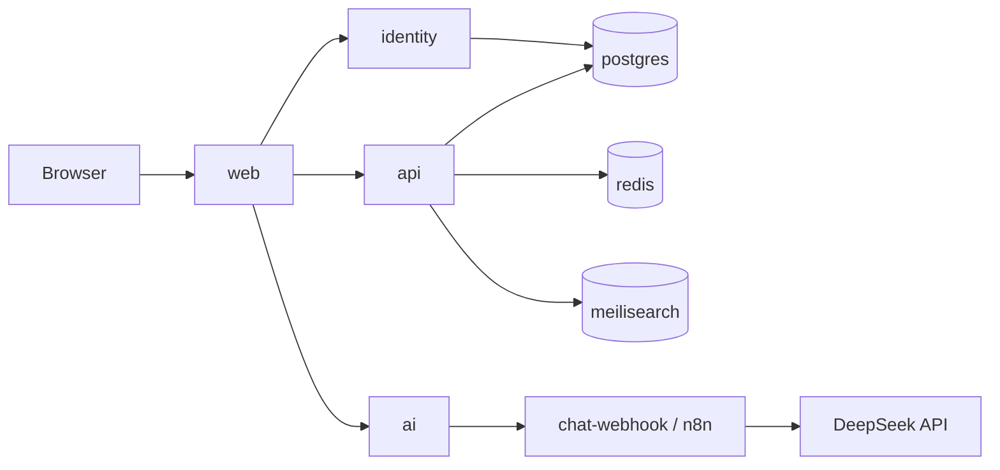

# TravelAI

<p align="center">
  
</p>

<p align="center">
  <strong>Lên kế hoạch chuyến đi thông minh — Việt Nam &amp; Thế giới</strong><br/>
  Traveloka-style marketplace + AI concierge (DeepSeek V4 Flash) · monorepo Docker
</p>

<p align="center">
  
  
  
  
  
  
  
  <a href="https://github.com/JasonTM17/VN_TravelAI/releases"></a>
  
</p>

---

## Screenshots

| Home + live catalog stats | Hotels list + pagination |
|:---:|:---:|
|  |  |

| Multi-slide hotel gallery | Tours catalog |
|:---:|:---:|
|  |  |

| Global chatbot | Admin console |
|:---:|:---:|
|  |  |

| AI planner | Mobile gallery (~390px) |
|:---:|:---:|
|  |  |

More assets: [`docs/media/`](docs/media/README.md)

---

## Features

- **Catalog (seeded Postgres)**: 40+ destinations · 140+ hotels · 120+ tours · flights & transport · multi-image galleries from DB `images[]`
- **Home promos**: data-driven `GET /v1/promos` (not hard-coded product cards)
- **Search**: Meilisearch reindex after boot
- **Auth**: Ed25519 JWT + dual JWKS (identity)
- **AI concierge**: chat + itinerary via n8n/HMAC; **DeepSeek V4 Flash** when `DEEPSEEK_API_KEY` is set
- **Admin**: `/vi/admin` reindex + audit log (`role=admin`)
- **Mobile web**: responsive navbar, promo carousel, touch targets
- **Containers**: multi-service Docker Compose · **Docker Hub** + **GitHub Packages (GHCR)** · tagged **Releases**

## Releases & packages

| Surface | Where |
|---------|--------|
| **Releases** | [github.com/JasonTM17/VN_TravelAI/releases](https://github.com/JasonTM17/VN_TravelAI/releases) — created by `.github/workflows/release.yml` on `v*` tags |
| **Packages (GHCR)** | Repo → Packages, or `ghcr.io/jasontm17/travelai-{web,api,identity,ai}` |
| **Docker Hub** | `nguyenson1710/travelai-*` (needs repo secrets `DOCKERHUB_USERNAME` + `DOCKERHUB_TOKEN`) |

```bash
# GitHub Container Registry (shows under repo Packages)
docker pull ghcr.io/jasontm17/travelai-web:latest
docker pull ghcr.io/jasontm17/travelai-api:latest
docker pull ghcr.io/jasontm17/travelai-identity:latest
docker pull ghcr.io/jasontm17/travelai-ai:latest
```

Publish flow: push `main` → `docker-publish` builds/pushes Hub + GHCR · tag `v0.1.0` or Actions → **release** workflow creates GitHub Release.

## Architecture



| Service | Path | Host port (local overlay) | GHCR | Docker Hub |
|---------|------|---------------------------|------|------------|
| web | [`web/`](web/README.md) | **53000** | `ghcr.io/jasontm17/travelai-web` | `nguyenson1710/travelai-web` |
| api | [`api/`](api/README.md) | **53001** | `ghcr.io/jasontm17/travelai-api` | `nguyenson1710/travelai-api` |
| identity | [`identity/`](identity/README.md) | **53002** | `ghcr.io/jasontm17/travelai-identity` | `nguyenson1710/travelai-identity` |
| ai | [`ai/`](ai/README.md) | **53003** | `ghcr.io/jasontm17/travelai-ai` | `nguyenson1710/travelai-ai` |

Contract: [`docs/openapi.yaml`](docs/openapi.yaml) · ADRs: [`docs/adr/`](docs/adr/) · Design: [`.stitch/`](.stitch/)

> SSR inside Docker uses `API_INTERNAL_URL=http://api:3001` while the browser uses `NEXT_PUBLIC_*` host ports.

---

## Quick start

```bash
git clone https://github.com/JasonTM17/VN_TravelAI.git
cd VN_TravelAI
cp .env.example .env

# Remapped ports (avoids FoodFlow / other stacks on 3000–3003)
docker compose -f docker-compose.yml -f docker-compose.local.yml up -d --build
```

| URL | Service |
|-----|---------|
| http://localhost:53000 | Web (default locale `vi`) |
| http://localhost:53001/healthz | API |
| http://localhost:53002/healthz | Identity |
| http://localhost:53003/healthz | AI |

**Demo user** (local only — see `.env.example`):

- Email: `demo@travelai.local`
- Password: `DemoTravelAI1!`
- Role: **admin** (local seed)

```bash
# Smoke
./scripts/smoke.ps1
# Live chat (optional DeepSeek key in .env)
node scripts/smoke-chat.mjs
```

### DeepSeek live chat

```env
DEEPSEEK_API_KEY=sk-...
DEEPSEEK_MODEL=deepseek-v4-flash
DEEPSEEK_BASE_URL=https://api.deepseek.com
```

```bash
docker compose -f docker-compose.yml -f docker-compose.local.yml up -d --force-recreate chat-webhook ai
# or
./scripts/reload-deepseek-chat.ps1
```

---

## Repository layout

```
api/          Fastify catalog, booking, promos, admin reindex
identity/     Auth, JWKS, demo admin user
ai/           Chat/itinerary orchestrator → HMAC webhook
web/          Next.js 15 App Router UI
infra/n8n/    Workflow JSON (travel-chat → DeepSeek)
docs/         OpenAPI, ADRs, media screenshots
scripts/      Smoke, image audit, DeepSeek helpers
.stitch/      Design system exports (tracked)
```

## Non-goals (MVP)

Real PSP settlement · native Flutter apps · live airline GDS · multi-vendor PMS.

## License

[MIT](LICENSE) © Nguyen Tien Son
