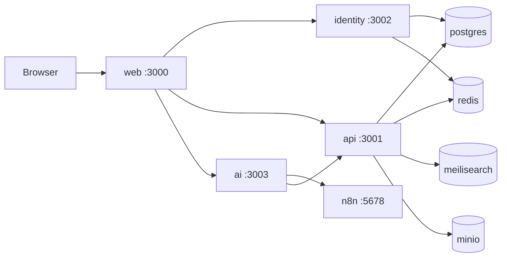

# TravelAI

Documentation: [English](README.md) · Vietnamese notes in product UI (`vi` default)

<p align="center">
  
  
  
  
  
  
  
  
</p>

**TravelAI** — *Lên kế hoạch chuyến đi thông minh — Việt Nam & Thế giới.*

Traveloka-style travel marketplace (destinations, hotels, flights mock, tours) plus a dedicated **AI Trip Planner** concierge.

## Architecture



| Service | Path | Port | Docker Hub |
|---------|------|------|------------|
| web | [`web/`](web/README.md) | 3000 | `nguyenson1710/travelai-web` |
| api | [`api/`](api/README.md) | 3001 | `nguyenson1710/travelai-api` |
| identity | [`identity/`](identity/README.md) | 3002 | `nguyenson1710/travelai-identity` |
| ai | [`ai/`](ai/README.md) | 3003 | `nguyenson1710/travelai-ai` |

Contract: [`docs/openapi.yaml`](docs/openapi.yaml) · ADRs: [`docs/adr/`](docs/adr/)

## Quick start (5 minutes)

```bash
cp .env.example .env
docker compose up -d --build
# Web:      http://localhost:3000
# API:      http://localhost:3001/healthz
# Identity: http://localhost:3002/healthz
# AI:       http://localhost:3003/healthz
# n8n:      http://localhost:5678
```

Demo user (local only): see `.env.example` (`DEMO_USER_EMAIL` / `DEMO_USER_PASSWORD`).

## Packages (Docker Hub)

Images publish on push to `main` (`latest` + git SHA):

- `nguyenson1710/travelai-web`
- `nguyenson1710/travelai-api`
- `nguyenson1710/travelai-identity`
- `nguyenson1710/travelai-ai`

GitHub Actions secrets: `DOCKERHUB_USERNAME`, `DOCKERHUB_TOKEN`.

## Core capabilities (MVP)

- Explore destinations (Vietnam first + world hotspots)
- Browse hotels, tours, mock flights/transport
- Booking funnel with mock payment
- Accounts: auth, wishlist, booking history
- **AI Trip Planner**: chat + multi-day itinerary via n8n

## Non-goals (phase 1)

Real PSP settlement, Flutter apps, live GDS airline inventory, multi-vendor PMS.

## License

[MIT](LICENSE) © Nguyen Tien Son
