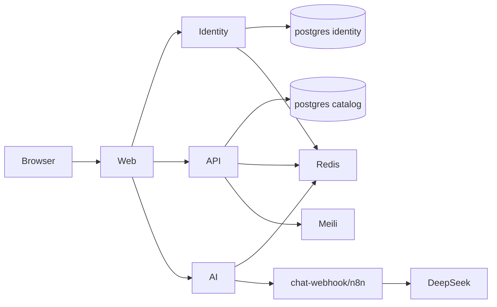

# Deep repository audit — TravelAI / Vietnam Travel

**Audit date:** 2026-07-10  
**HEAD:** `b49481d`  
**Mode:** read-only static analysis + existing docs/scout  
**No source changes · no secrets · no image publish**

---

## 1. Executive summary

TravelAI is a **service-split monorepo** (not FastAPI monolith): Next.js 15 web + three Fastify 5 services (api, identity, ai), PostgreSQL (2 DBs), Redis, Meilisearch, optional MinIO/n8n, local DeepSeek via HMAC chat-webhook.

**Maturity:** Local demo marketplace + hardening baseline **usable**. Payment **MOCK**. GHCR/Docker Hub packages **empty** because **GitHub Actions billing blocks runners** — not missing workflow code.

| Area | Verdict |
|------|---------|
| Stack claims | CONFIRMED Fastify/Next/PG/Meili/Ed25519; **NOT** FastAPI |
| Catalog/search/auth/booking mock | COMPLETE demo paths |
| Real PSP / RAG / Traveloka | MISSING / OUT_OF_SCOPE |
| Container images public | **BROKEN ops** (billing) |
| Production-ready | PARTIAL |

---

## 2. Repository map

```
web/          Next.js 15.5 App Router UI
api/          Fastify catalog, search, bookings, wishlist, chat history, admin
identity/     Fastify auth, JWKS Ed25519, refresh cookie
ai/           Fastify chat/itinerary orchestrator → HMAC webhook
e2e/          Playwright
scripts/      smoke, DeepSeek webhook + tools
infra/n8n/    workflow JSON
docs/         OpenAPI, ADR, media, reports
docker-compose.yml | .local.yml | .prod.yml
.github/workflows/
```

**Package manager:** pnpm per service (no root workspace).  
**Ignore:** node_modules, .next, dist, coverage.

---

## 3. Tech stack (evidence)

| Layer | Tech | Path |
|-------|------|------|
| Web | next@15.5.16, react@19 | `web/package.json` |
| API/Identity/AI | fastify@^5.2.1 | `*/package.json` |
| ORM | Prisma ^6.5 | `api|identity/prisma` |
| DB | postgres:16 | compose |
| Search | Meilisearch v1.11 | compose + `api/src/lib/meili.ts` |
| Auth | jose EdDSA JWKS | `identity/src/lib/keys.ts` |
| AI | DeepSeek HTTP + tools | `scripts/lib/deepseek-*.mjs` |

---

## 4. Architecture



**Dependency direction:** web → backends only; no FE→DB.  
**Coupling residual:** hand-written `web/src/lib/api.ts` vs generated OpenAPI client.  
**Over-engineered:** MinIO in default stack with no app S3 client (DISCONNECTED).

---

## 5. End-to-end flows (verified paths)

| Flow | Path evidence |
|------|----------------|
| Catalog SSR | `web/src/app/[locale]/page.tsx` → api catalog routes |
| Search | `GET /v1/search` + Meili + `meili-filter.ts` |
| Auth | identity auth routes + cookie refresh + sessionStorage access |
| Booking mock | `bookings.ts` + `booking-state.ts` + `inventory.ts` |
| Chat | web widget → ai `/v1/chat` → webhook → DeepSeek; persist `chat-history.ts` |
| Admin reindex | admin JWT + optional `X-Admin-Token` |
| Image publish | `docker-publish.yml` (runtime blocked by billing) |

---

## 6. API inventory (high level)

See OpenAPI `docs/openapi.yaml` + services:

- **identity:** register/login/refresh/logout/me/change-password, JWKS, health  
- **api:** destinations/hotels/tours/flights/transports/search/promos/bookings/wishlists/chat history/admin  
- **ai:** chat, itineraries, n8n-callback HMAC  

Contract drift residual: runtime client hand-written; generated client not sole runtime path.

---

## 7. Database overview

| DB | Models (selected) |
|----|-------------------|
| identity | User, RefreshToken |
| catalog | Destination, Hotel, Tour, Flight(+seatsLeft), Transport(+seatsLeft), Booking, PaymentAttempt, ChatConversation, ChatMessage, Wishlist, Promo, Itinerary, AdminAuditLog |

Migrations under `*/prisma/migrations/`. Seed gated `RUN_SEED`.

---

## 8. Testing

| Layer | Location | CI |
|-------|----------|-----|
| Unit Vitest | services | hard-fail |
| Lint/tsc | per service | hard-fail (`b49481d` clean) |
| OpenAPI Redocly | docs | job openapi |
| E2E Playwright | e2e/ | gated `E2E_ENABLED`; runners need billing |
| Script tests | deepseek-*.test.mjs | local |

**Gap:** e2e still checks `localStorage.getItem("travelai_access")` while app uses sessionStorage (`e2e/tests/auth-register-change-password.spec.ts`).

---

## 9. Confidence & limits

- Static evidence high for structure/security remediations.  
- Runtime package publish **not** re-verified this pass beyond prior Actions annotation.  
- No exploit testing performed.

**Related reports:** security, feature-gap, AI, docker-cicd, master remediation plan.
