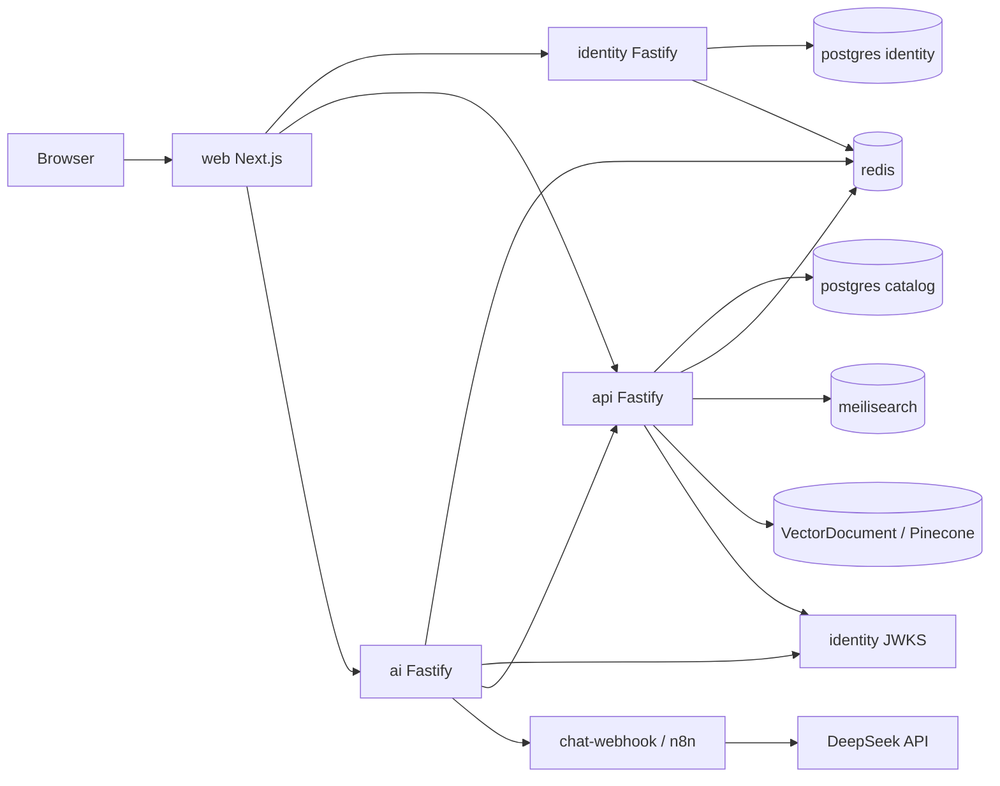

# System architecture — TravelAI

**Purpose:** Kiến trúc runtime và ranh giới service.  
**Last verified:** `9f4d424`

## 1. Overview

TravelAI là monorepo **service-based**: browser nói chuyện HTTP với `web`, `identity`, `api`, `ai`. Data plane: PostgreSQL (2 DB), Redis, Meilisearch. AI path: catalog RAG (Meili + vectors) → HMAC webhook → n8n **hoặc** local `chat-webhook` → DeepSeek (tools + stream).



## 2. Dependency direction

```
web → identity | api | ai
api → postgres, redis, meilisearch, identity JWKS, optional Pinecone/embedding API
identity → postgres, redis
ai → redis, identity JWKS, N8N_WEBHOOK_BASE_URL, API_BASE_URL (RAG)
```

- Không FE → DB trực tiếp.
- Không circular service import (HTTP only).
- Catalog `userId` trên booking **không** FK sang identity DB (cross-DB — by design).

## 3. Auth

1. `POST /v1/auth/register|login` → access JWT (EdDSA) + opaque refresh  
2. Refresh set as **httpOnly cookie** on identity origin; access token **in-memory** on web (optional `sessionStorage` if `NEXT_PUBLIC_PERSIST_ACCESS=true`)  
3. 401 + Bearer → single-flight cookie refresh (`web/src/lib/api.ts`, `credentials: include` on identity)  
4. api/ai verify JWT via JWKS dual slot  
5. Production: PEM fail-closed (`identity/src/lib/keys.ts`)

Chi tiết: [ADR-0006](./adr/0006-ed25519-jwt-auth.md), [data-flows](./architecture/data-flows.md).

## 4. Booking & inventory

```
create (pending_payment) + Idempotency-Key
  hotel → room type + rate plan (default STD/BAR) → night inventory check
  flight/transport → seats check
→ mock pay → confirmed → decrement inventory + email notify
→ cancel → restore inventory when confirmed
```

- Payment **MOCK** — `PaymentAttempt` ledger, không PSP webhook  
- Hotel PMS: `HotelRoomType`, `RatePlan`, `HotelNightInventory` (per room type when set)  
Evidence: `api/src/routes/bookings.ts`, `api/src/lib/hotel-night-inventory.ts`, `api/src/lib/pms.ts`.

## 5. Search & vectors

| Path | Status |
|------|--------|
| Meilisearch keyword (`GET /v1/search`) | COMPLETE |
| Admin Meili reindex | COMPLETE |
| Embeddings + `VectorDocument` Postgres | COMPLETE path |
| Pinecone upsert/query when keys set | COMPLETE path |
| `GET /v1/search/vectors` | COMPLETE path |
| Admin vector reindex | COMPLETE |

ADR Meili: [0007](./adr/0007-meilisearch-catalog-search.md).

## 6. AI

```
POST /v1/chat | /v1/chat/stream (JWT)
  → Meili + vector catalog RAG (API)
  → rate limit → HMAC webhook → DeepSeek tools | degraded template
  → optional chat message persist (api chat-history)
```

| Capability | Status |
|------------|--------|
| Live DeepSeek when key set | COMPLETE path |
| Degraded fallback | COMPLETE |
| Meili + vector RAG | COMPLETE path |
| Read-only tool-calling | COMPLETE path |
| SSE streaming | COMPLETE path |
| Chat conversation/message DB | COMPLETE path |

Local: `docker-compose.local.yml` → `chat-webhook`.  
Base: n8n + `infra/n8n/workflows/` (import thủ công — DISCONNECTED auto).  
ADR: [0004](./adr/0004-ai-via-n8n.md).

## 7. Notifications

```
pay success → notifyBookingConfirmed → Notification row → sendMail
  SMTP (nodemailer) | HTTP gateway | log-only
```

Evidence: `api/src/lib/mailer.ts`, `api/src/lib/notify.ts`.

## 8. Observability

| Signal | Status |
|--------|--------|
| `/healthz` `/readyz` `/metrics` | COMPLETE per service |
| `x-request-id` | COMPLETE identity/api/ai |
| Optional `METRICS_TOKEN` | COMPLETE when set |
| OTel / distributed tracing | NOT IMPLEMENTED |
| Central log stack | NOT IMPLEMENTED in-repo |

## 9. Keep / refactor / avoid

| Keep | Refactor candidates | Avoid |
|------|---------------------|-------|
| Service split + JWKS | Wire generated OpenAPI client at runtime | Merge to Next monolith API |
| Compose overlays local/prod | Full OTel stack when needed | Invent Kafka/K8s without need |
| Degraded AI path | Real PSP when product decides | Fake “production payment ready” |
| httpOnly refresh | Drop MinIO from default compose | Traveloka partner API invent |

## 10. Related

- [Services](./architecture/services.md)
- [Data flows](./architecture/data-flows.md)
- [PDR](./project-overview-pdr.md)
