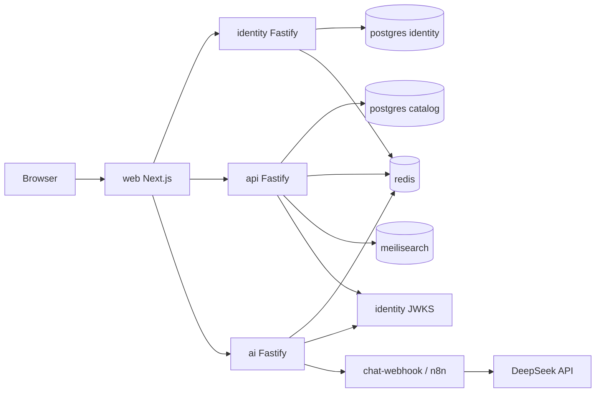

# System architecture — TravelAI

**Purpose:** Kiến trúc runtime và ranh giới service.  
**Last verified:** `e715b96`

## 1. Overview

TravelAI là monorepo **service-based**: browser chỉ nói chuyện HTTP với `web`, `identity`, `api`, `ai`. Data plane: PostgreSQL (2 DB), Redis, Meilisearch. AI path: HMAC webhook → n8n **hoặc** local `chat-webhook` → DeepSeek.



## 2. Dependency direction

```
web → identity | api | ai
api → postgres, redis, meilisearch, identity JWKS
identity → postgres, redis
ai → redis, identity JWKS, N8N_WEBHOOK_BASE_URL
```

- Không FE → DB trực tiếp.
- Không circular service import (HTTP only).
- Catalog userId trên booking **không** FK sang identity DB (cross-DB — by design).

## 3. Auth

1. `POST /v1/auth/register|login` → access JWT (EdDSA) + opaque refresh  
2. Web lưu `localStorage` (`web/src/lib/auth-storage.ts`)  
3. 401 + Bearer → single-flight refresh (`web/src/lib/api.ts`)  
4. api/ai verify JWT qua JWKS dual slot  
5. Production: PEM bắt buộc (`identity/src/lib/keys.ts` fail-closed)

Chi tiết: [ADR-0006](./adr/0006-ed25519-jwt-auth.md), [data-flows](./architecture/data-flows.md).

## 4. Booking

```
create (pending_payment/draft) → mock pay → confirmed
cancel if canTransition(from, cancelled)
```

Payment **MOCK** — không có PSP webhook. Evidence: `api/src/lib/booking-state.ts`, `api/src/routes/bookings.ts`.

## 5. Search

- Write path: Postgres seed/CRUD read models  
- Search path: Meilisearch indexes; filters sanitize `api/src/lib/meili-filter.ts`  
- Admin reindex: `POST /v1/admin/reindex`  
ADR: [0007](./adr/0007-meilisearch-catalog-search.md)

## 6. AI

```
POST /v1/chat (JWT) → rate limit → HMAC webhook → DeepSeek | degraded template
```

- **NOT IMPLEMENTED:** RAG, embeddings, tool-calling, chat message DB, streaming SSE  
- Local: `docker-compose.local.yml` → `chat-webhook`  
- Base: n8n container + JSON `infra/n8n/workflows/` (import thủ công — DISCONNECTED auto)  
ADR: [0004](./adr/0004-ai-via-n8n.md)

## 7. Observability

| Signal | Status |
|--------|--------|
| `/healthz` `/readyz` `/metrics` | COMPLETE per service |
| `x-request-id` | COMPLETE identity/api/ai |
| OTel / distributed tracing | NOT IMPLEMENTED |
| Central log stack | NOT IMPLEMENTED in-repo |

## 8. Keep / refactor / avoid

| Keep | Refactor candidates | Avoid |
|------|---------------------|-------|
| Service split + JWKS | Cookie BFF session | Merge to Next monolith API |
| Compose overlays local/prod | Wire generated OpenAPI client runtime | Invent Kafka/K8s without need |
| Degraded AI path | Drop unused MinIO from default | Fake production-ready claims |

## 9. Related

- [Services](./architecture/services.md)
- [Scout](./reports/vietnam-travel-codebase-scout.md)
